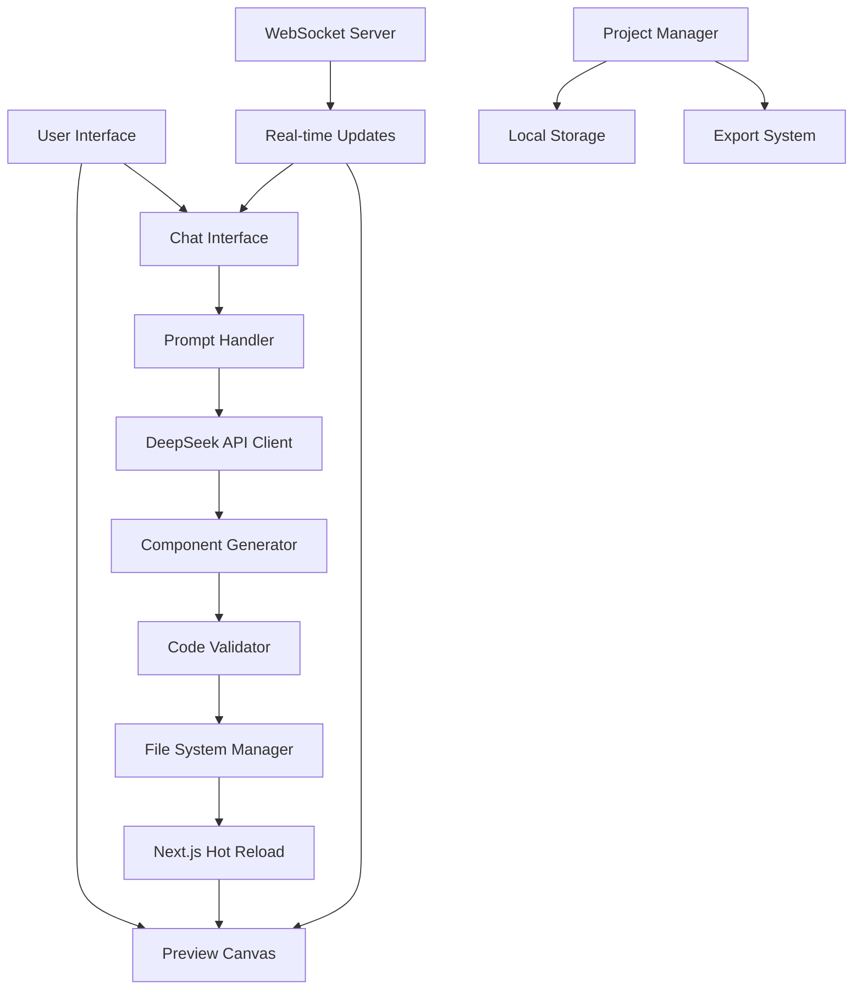

# AI Landing Page Builder - Design Document

## Overview

The AI Landing Page Builder is a Next.js 15 application that provides a conversational interface for creating landing pages. The system uses a split-panel layout with a chat interface on the left and a live preview canvas on the right. The architecture is built around DeepSeek API integration for code generation, with real-time component rendering and WebSocket communication for instant updates.

## Architecture

### High-Level System Architecture



### Technology Stack

- **Frontend Framework:** Next.js 15 with App Router
- **UI Framework:** React 19 with TypeScript
- **Styling:** Tailwind CSS 4
- **AI Integration:** DeepSeek API
- **Real-time Communication:** WebSockets
- **Development Server:** Custom HTTP server with hot reload
- **State Management:** React Context + Local Storage
- **Code Generation:** Dynamic component creation and file system operations

## Components and Interfaces

### Core Components

#### 1. ChatInterface Component
```typescript
interface ChatInterfaceProps {
  onPromptSubmit: (prompt: string) => Promise<void>;
  conversation: ConversationMessage[];
  isProcessing: boolean;
  suggestions: string[];
}

interface ConversationMessage {
  id: string;
  type: 'user' | 'ai' | 'system';
  content: string;
  timestamp: Date;
  metadata?: {
    model: 'deepseek';
    processingTime: number;
    componentGenerated?: string;
  };
}
```

#### 2. PreviewCanvas Component
```typescript
interface PreviewCanvasProps {
  currentProject: Project;
  deviceView: 'desktop' | 'tablet' | 'mobile';
  onDeviceChange: (device: DeviceView) => void;
  highlightedComponent?: string;
}

interface Project {
  id: string;
  name: string;
  components: GeneratedComponent[];
  pages: PageConfig[];
  theme: ThemeConfig;
  lastModified: Date;
}
```

#### 3. DeepSeekClient Service
```typescript
interface DeepSeekClient {
  generateComponent(prompt: string, context: ProjectContext): Promise<ComponentResult>;
  validateCode(code: string): Promise<ValidationResult>;
  suggestImprovements(component: string): Promise<string[]>;
}

interface ComponentResult {
  code: string;
  filename: string;
  dependencies: string[];
  description: string;
  errors?: string[];
}
```

### API Interfaces

#### WebSocket Events
```typescript
interface WebSocketEvents {
  'component:generated': {
    componentId: string;
    code: string;
    filename: string;
  };
  'preview:update': {
    projectId: string;
    timestamp: Date;
  };
  'error:occurred': {
    type: 'generation' | 'validation' | 'rendering';
    message: string;
    details?: any;
  };
}
```

#### HTTP API Endpoints
```typescript
// POST /api/generate
interface GenerateRequest {
  prompt: string;
  projectId: string;
  context: ProjectContext;
}

interface GenerateResponse {
  success: boolean;
  component?: ComponentResult;
  error?: string;
  suggestions?: string[];
}

// POST /api/projects/export
interface ExportRequest {
  projectId: string;
  format: 'zip' | 'vercel';
}
```

## Data Models

### Project Structure
```typescript
interface Project {
  id: string;
  name: string;
  description?: string;
  created: Date;
  lastModified: Date;
  
  // Component management
  components: Map<string, GeneratedComponent>;
  pages: Map<string, PageConfig>;
  
  // Configuration
  theme: ThemeConfig;
  settings: ProjectSettings;
  
  // History and versioning
  conversationHistory: ConversationMessage[];
  versionHistory: ProjectVersion[];
}

interface GeneratedComponent {
  id: string;
  name: string;
  type: 'hero' | 'testimonials' | 'cta' | 'footer' | 'custom';
  code: string;
  styles?: string;
  props: ComponentProps;
  dependencies: string[];
  generatedBy: {
    model: 'deepseek';
    prompt: string;
    timestamp: Date;
  };
}

interface ThemeConfig {
  colors: {
    primary: string;
    secondary: string;
    accent: string;
    background: string;
    text: string;
  };
  typography: {
    headingFont: string;
    bodyFont: string;
    codeFont: string;
  };
  spacing: {
    scale: number;
    containerMaxWidth: string;
  };
}
```

### File System Structure
```
genesis-landing/
├── src/
│   ├── app/
│   │   ├── components/           # AI-generated components
│   │   │   ├── Hero/
│   │   │   │   ├── Hero.tsx
│   │   │   │   └── Hero.module.css
│   │   │   └── [component-name]/
│   │   ├── api/
│   │   │   ├── generate/
│   │   │   │   └── route.ts      # DeepSeek API integration
│   │   │   ├── projects/
│   │   │   │   └── route.ts      # Project management
│   │   │   └── ws/
│   │   │       └── route.ts      # WebSocket handler
│   │   ├── page.tsx              # Main application
│   │   └── layout.tsx
│   ├── lib/
│   │   ├── deepseek-client.ts    # AI API client
│   │   ├── component-generator.ts # Code generation logic
│   │   ├── project-manager.ts    # Project persistence
│   │   └── websocket-server.ts   # Real-time communication
│   └── types/
│       ├── project.ts
│       ├── components.ts
│       └── api.ts
```

## Error Handling

### Error Categories and Responses

1. **AI Generation Errors**
   - API rate limits: Queue requests and show wait time
   - Invalid responses: Retry with modified prompt
   - Network failures: Offline mode with cached suggestions

2. **Code Validation Errors**
   - Syntax errors: Highlight issues and suggest fixes
   - Next.js compatibility: Auto-fix common patterns
   - TypeScript errors: Generate proper interfaces

3. **Preview Rendering Errors**
   - Component crashes: Error boundaries with fallback UI
   - Build failures: Show detailed error logs
   - Hot reload issues: Force refresh with user notification

### Error Recovery Strategies
```typescript
interface ErrorHandler {
  handleGenerationError(error: GenerationError): Promise<RecoveryAction>;
  handleValidationError(error: ValidationError): Promise<ComponentResult>;
  handleRenderingError(error: RenderingError): Promise<void>;
}

type RecoveryAction = 
  | { type: 'retry'; modifiedPrompt: string }
  | { type: 'fallback'; template: string }
  | { type: 'manual'; instructions: string };
```

## Testing Strategy

### Unit Testing
- **Component Generation:** Test DeepSeek API integration with mock responses
- **Code Validation:** Verify TypeScript and Next.js compatibility checks
- **Project Management:** Test CRUD operations and data persistence
- **WebSocket Communication:** Mock real-time event handling

### Integration Testing
- **End-to-End Workflows:** User prompt → AI generation → Preview update
- **API Integration:** DeepSeek API error handling and rate limiting
- **File System Operations:** Component creation and project export
- **Cross-Device Preview:** Responsive design validation

### Performance Testing
- **AI Response Times:** Measure generation latency under load
- **Preview Rendering:** Test hot reload performance with large projects
- **Memory Usage:** Monitor component generation and cleanup
- **Concurrent Users:** WebSocket connection scaling

### Testing Tools and Setup
```typescript
// Jest configuration for component testing
interface TestConfig {
  testEnvironment: 'jsdom';
  setupFilesAfterEnv: ['<rootDir>/src/test/setup.ts'];
  moduleNameMapping: {
    '^@/(.*)$': '<rootDir>/src/$1';
  };
}

// Mock DeepSeek API for testing
interface MockDeepSeekClient {
  generateComponent: jest.MockedFunction<typeof generateComponent>;
  validateCode: jest.MockedFunction<typeof validateCode>;
}
```

## Security Considerations

### API Security
- **Rate Limiting:** Implement per-user request limits for DeepSeek API
- **Input Sanitization:** Validate and sanitize all user prompts
- **Code Injection Prevention:** Sandbox generated code execution
- **API Key Management:** Secure storage and rotation of DeepSeek credentials

### Data Protection
- **Local Storage Encryption:** Encrypt sensitive project data
- **Session Management:** Secure WebSocket connections with authentication
- **Export Security:** Validate generated code before download
- **Privacy:** No user data sent to external services beyond DeepSeek API

## Performance Optimization

### Frontend Optimization
- **Code Splitting:** Dynamic imports for generated components
- **Lazy Loading:** Load preview components on demand
- **Memoization:** Cache AI responses and component renders
- **Bundle Optimization:** Tree shaking and dead code elimination

### Backend Optimization
- **API Caching:** Cache DeepSeek responses for similar prompts
- **WebSocket Pooling:** Efficient connection management
- **File System Optimization:** Batch file operations
- **Memory Management:** Cleanup unused components and projects

### Monitoring and Analytics
```typescript
interface PerformanceMetrics {
  aiResponseTime: number;
  componentGenerationTime: number;
  previewRenderTime: number;
  memoryUsage: number;
  activeConnections: number;
}
```