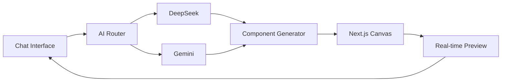
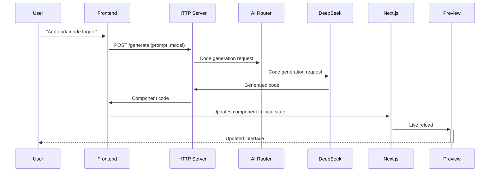

# Genesis Landing - Design Specifications

This document outlines the design specifications for the Lovable/Bolt-style AI-driven landing page builder.

## Core Experience Principle
**Conversational UI First:** All user interactions happen through natural language prompts. The AI interprets requests and instantly generates/modifies components in real-time.

## AI Model Integration
**Dual-Model Architecture:** The system leverages both DeepSeek and Gemini AI models for optimal performance
*   **DeepSeek:** Primary model for component generation and code execution
*   **Gemini:** Specialized for design suggestions and creative content
*   **Model Selection:** Automatic routing based on task type
*   **Fallback Mechanism:** If one model fails, automatically retries with the other

## Workflow Design
1. **Prompt Input:** User describes desired changes in plain English
2. **AI Interpretation:** System routes request to appropriate model (DeepSeek/Gemini)
3. **Component Generation:** AI creates/modifies Next.js components
4. **Instant Preview:** Changes rendered in real-time canvas
5. **Iteration Loop:** User provides follow-up prompts to refine

## AI Capabilities
* **Component Creation:** "Add a testimonial section with 3 customer quotes" (DeepSeek)
* **Style Modifications:** "Make the header sticky and change font to Montserrat" (DeepSeek)
* **Content Generation:** "Write hero copy for a SaaS analytics platform" (Gemini)
* **Layout Adjustments:** "Convert this section to a 2-column grid on desktop" (DeepSeek)
* **Design Suggestions:** "Suggest a color scheme for a fintech brand" (Gemini)
* **Error Correction:** "The CTA button isn't centered on mobile" (DeepSeek)

## UI Layout


### Chat Interface (Left Panel)
- **Prompt Input:** Natural language command field
- **Model Indicators:** Shows active AI model (DeepSeek/Gemini)
- **Conversation History:** Threaded prompt/response dialog
- **Suggestions:** Context-aware prompt starters
- **Status Indicators:** AI processing/rendering states

### Preview Canvas (Right Panel)
- **Device Toggles:** Desktop/Tablet/Mobile views
- **Component Outlines:** Hover highlights for editable elements
- **Live Reload:** Instant updates after AI processing
- **Error Overlays:** Next.js hydration/warning indicators
- **Model Attribution:** Shows which AI generated each component

## Component Architecture
```plaintext
app/
├── components/  # AI-generated reusable components
│   ├── Hero/
│   │   ├── Hero.tsx
│   │   └── Hero.module.css
│   └── Testimonials/
│       ├── Testimonials.tsx
│       └── Testimonials.module.css
├── page.tsx     # AI-managed page composition
└── layout.tsx   # AI-managed global layout
```

## Next.js Implementation Requirements
1. **Component Generation:**
   - AI creates components in `app/components`
   - Follows atomic design principles
   - Includes TypeScript interfaces
   - Model-specific optimizations (DeepSeek/Gemini)

2. **Real-time Rendering:**
   - HTTP requests for instant updates
   - Next.js Fast Refresh integration
   - Component-level hot reloading

3. **AI Model Routing:**
   - DeepSeek for code generation tasks
   - Gemini for creative/content tasks
   - Automatic fallback mechanism

4. **Performance Optimization:**
   - Automatic image optimization via `next/image`
   - Dynamic imports for heavy components
   - Static generation for published pages

5. **AI Constraints:**
   - Strict separation of server/client components
   - Automatic route metadata generation
   - Error boundary wrappers for dynamic content

## Visual Design System
### Dynamic Theming
- AI-managed CSS variables for colors
- Theme generator based on brand attributes
- Accessibility-compliant contrast ratios

### Typography
- **Headings:** Inter (600-700 weight)
- **Body:** Open Sans (400 weight)
- **Code:** Fira Code (monospace)
- AI-controlled font scaling system

### Interaction Design
- **Hover States:** AI-generated micro-interactions
- **Transitions:** Context-aware animations
- **Feedback:** AI-suggested UX improvements

## Quality Assurance
1. **AI Validation:**
   - Component syntax checking
   - Next.js best practice audits
   - Accessibility compliance scanning

2. **Model Consistency:**
   - Output standardization between DeepSeek/Gemini
   - Cross-model validation checks
   - Quality scoring for generated components

3. **User Controls:**
   - "Undo" for AI-generated changes
   - Version history browser
   - Manual model selection
   - Manual override mode (expert users)

## Integration Points

